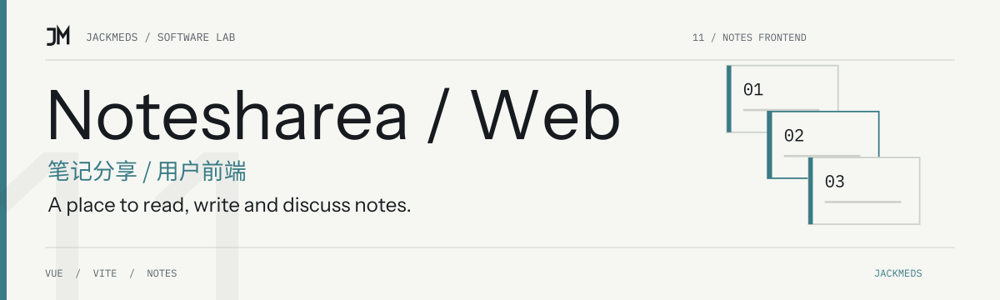

<!-- jackmeds-brand:start -->
<picture>
  <source media="(prefers-color-scheme: dark)" srcset="assets/brand/hero-dark.svg">
  
</picture>
<!-- jackmeds-brand:end -->

# Notesharea · 简单纯净的笔记分享

把写下的知识与想法分享出来，在一个轻量界面中阅读、创作和讨论笔记。

Notesharea is a Vue 3 note-sharing frontend for reading, writing and discussing notes, backed by a separate Koa service.

## 从这里开始

这是 Notesharea 的读者与创作前台。运行完整功能需要先启动 [Notesharea-server](https://github.com/JackMeds/Notesharea-server)；管理端在 [Notesharea-admin](https://github.com/JackMeds/Notesharea-admin)。

## 已有能力

- 浏览笔记列表与详情，注册和登录。
- 通过富文本编辑器创建与编辑笔记。
- 点赞、收藏、评论和回复入口。
- 个人资料与自己发布的笔记页面。

页面入口见 [路由表](src/router/index.js)，编辑器页面见 [create.vue](src/views/home/create.vue)。界面中的图片上传仍指向演示接口，不应当作已经接入正式媒体存储的功能。

## 本地开发

准备 Node.js 与 npm，并按后端仓库说明配置 MySQL、Redis 与 API。本项目使用 Vue 3、Vite 4、Naive UI 和 WangEditor；仓库没有固定 Node 版本。

```bash
npm install
npm run dev
```

打开终端显示的开发地址。配套后端默认允许 `http://localhost:5173`，API 默认使用 `http://localhost:3000`。

[vite.config.js](vite.config.js) 将相对 `/api` 请求代理到 `http://127.0.0.1:3000`，但现有页面中也有直接请求 `http://localhost:3000` 的代码。切换环境时需要检查两种入口；仅修改 Vite 代理不会替换页面里的绝对地址。

## 构建与预览

```bash
npm run build
npm run preview
```

构建结果在 `dist/`。静态托管需要为 HTML5 history 路由提供 `index.html` 回退；生产 API 地址和会话跨域配置需要另外设置。构建预览仍依赖后端数据，不是独立离线应用。

以上命令已与 [package.json](package.json) 核对，本次文档整理未执行依赖安装或完整用户流程测试。

## 数据与项目关系

笔记、账户和互动请求发送到配置的 Notesharea 后端，不能把这个分享网站视为仅保存在本机的私人笔记本。创作页与编辑页中的上传地址仍是外部演示服务，请先完成媒体接口联调再使用真实文件。

Notesharea 的前台、后台与 API 分属三个仓库；[HaoXing](https://github.com/JackMeds/HaoXing) 是另一个独立的小说与音频项目，不是启动本站的依赖。

## 许可

当前仓库没有项目级许可证文件或 `package.json` 许可证声明。本次整理不新增授权；所用依赖与原有素材保留各自许可和署名。
